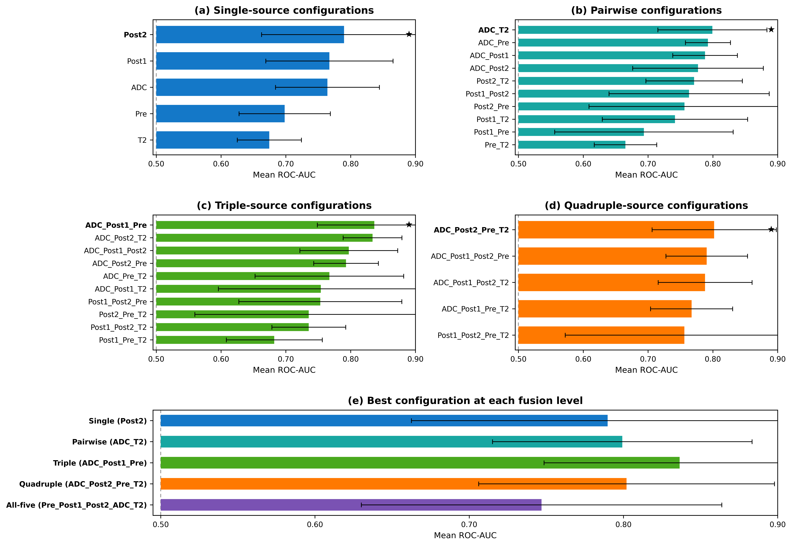
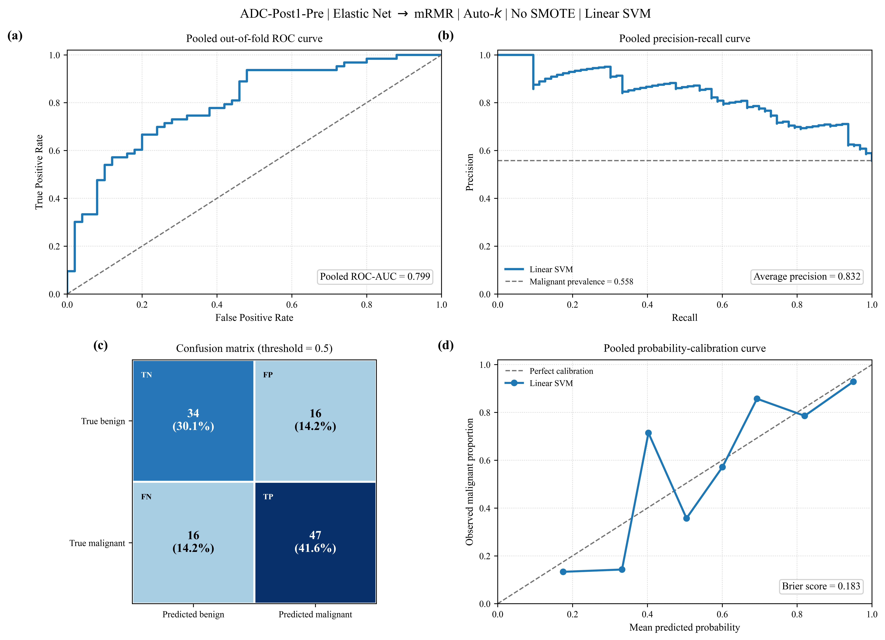
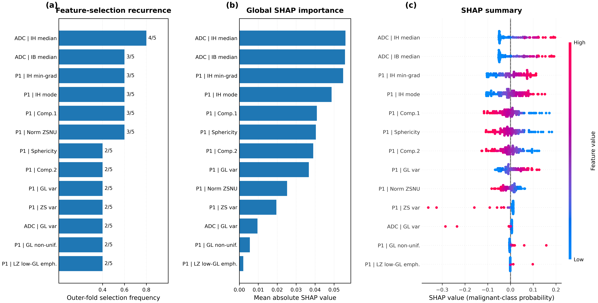

<div align="center">

🌐 **Project Website**

<a href="https://en-mah.github.io/MRI-Breast-Radiomics-Classification/">
https://en-mah.github.io/MRI-Breast-Radiomics-Classification/
</a>

</div>


<div align="center">

# 🧬 Explainable Breast MRI Radiomics

### A patient-aware **machine-learning** framework with **selective multiparametric feature fusion**<br>for benign and malignant breast lesion classification

<p>


</p>

<sub>Source code accompanying the manuscript</sub>

</div>

---

<div align="center">

<br>
<sub><b>Performance across all 31 MRI radiomic source configurations.</b> Bars show the highest-ranked pipeline for each source configuration according to mean ROC-AUC across the five patient-aware outer folds; error bars show fold-to-fold variability.</sub>
</div>

---

## 📋 At a glance

| | |
|---|---|
| 🎯 **Task** | Binary classification of benign vs. malignant / high-suspicion breast lesions |
| 🧲 **MRI sources** | ADC · DCE-Pre · DCE-Post1 · DCE-Post2 · T2W |
| 🧬 **Radiomics** | 144 features extracted independently from each MRI source |
| 🔀 **Configurations** | 5 single · 10 pairwise · 10 triple · 5 quadruple · 1 all-five = **31** |
| 🧠 **Models** | 10 supervised classifiers |
| 🔬 **Feature selection** | Correlation → mRMR · Elastic Net → mRMR · mRMR → Elastic Net |
| ⚖️ **Balancing** | SMOTE vs. no-SMOTE |
| 🎲 **Protocol** | 5-fold outer + 3-fold inner **patient-aware nested CV** |
| 👁️ **Interpretability** | Feature-selection stability + SHAP |
| 🏆 **Best model** | ADC + Post1 + Pre · EN → mRMR · Auto-k · no SMOTE · Linear SVM |
| 📈 **Best performance** | Mean ROC-AUC **0.836 ± 0.088** · pooled ROC-AUC **0.799** |

> [!IMPORTANT]
> **Patient identity is the grouping variable throughout model development.**  
> All ROIs belonging to the same patient remain in the same cross-validation partition, and
> preprocessing, feature selection, SMOTE and hyperparameter optimisation are restricted to
> training data.

---

## 🗂️ Repository layout

| Path | Stage | Purpose |
|---|:---:|---|
| 📦 `Dataset/` | 0 | Source radiomic CSV files for ADC, Pre, Post1, Post2 and T2 |
| 1️⃣ `Single/` | 1 | Single-source modelling for each MRI-derived feature table |
| 2️⃣ `Pairwise/` | 2 | All 10 two-source feature-fusion experiments |
| 3️⃣ `Triple/` | 3 | All 10 three-source feature-fusion experiments |
| 4️⃣ `Quadruple/` | 4 | All 5 four-source feature-fusion experiments |
| 5️⃣ `AllFive/` | 5 | Complete five-source feature concatenation |
| 📊 `Figs/` | — | Publication and diagnostic figures |

Representative notebooks include:

```text
Single/Single.ipynb
Single/Batch_Run_On_Single_batch.ipynb

Pairwise/Pairwise.ipynb
Pairwise/Batch_Run_All_10_Pairwise.ipynb

Triple/
Quadruple/
AllFive/
```

The same patient-aware modelling logic is reused across source combinations.

---

## 🏷️ Label mapping

The study converts radiologist-assigned BI-RADS assessments into the binary target used by the
machine-learning pipeline.

| BI-RADS category | Model label | Interpretation |
|:---:|:---:|---|
| 1–3 | **0** | Benign / low suspicion |
| 4–5 | **1** | Malignant / high suspicion |

The lesion ROI is the prediction unit. Patient identity is used only for grouping during validation
so that multiple ROIs from one patient cannot be split across training and test partitions.

---

## 🔄 Pipeline

```text
 multiparametric breast MRI
 ADC · DCE-Pre · DCE-Post1 · DCE-Post2 · T2W
        │
        │  manual 3D lesion segmentation + mask alignment
        ▼
 preprocessed MRI volumes
        │
        │  LIFEx radiomic feature extraction
        ▼
 five source-specific radiomic feature tables
        │
        │  ROI matching + feature concatenation
        ▼
 31 single- and multi-source configurations
        │
        │  patient-aware nested CV
        ▼
 outer-training patients
        │
        ├── median imputation
        ├── variance filtering
        ├── feature selection
        ├── Auto-k feature-count selection
        ├── standardisation
        ├── optional SMOTE
        └── Optuna hyperparameter optimisation
        │
        ▼
 final model fit
        │
        ▼
 untouched outer-test patients
        │
        ├── ROC-AUC / PR-AUC
        ├── threshold metrics
        ├── calibration / Brier score
        └── pooled out-of-fold predictions
        │
        ▼
 feature stability + SHAP interpretation
```

Two properties of the modelling design govern how the reported performance should be read:

- 🔒 **Patient-level separation is enforced throughout CV.** No patient contributes ROIs to both
  training and outer-test data in the same fold.
- ✅ **All fitted preprocessing is training-only.** Imputation statistics, variance filtering,
  feature selection, standardisation, SMOTE and hyperparameter tuning are learned without access
  to the corresponding outer-test data.

---

## 📦 Expected data layout

The downstream ML pipeline operates on pre-extracted radiomic CSV tables.

<details>
<summary><b>Show the expected source-data tree</b></summary>

```text
Dataset/
└── Breast-Data/
    └── Mask1/
        ├── ADC_M1.csv
        ├── Pre_M1.csv
        ├── Post1_M1.csv
        ├── Post2_M1.csv
        └── T2_M1.csv
```

</details>

Each row represents one lesion ROI. The tables contain:

```text
INFO_PatientName / PatientID   patient grouping identifier
INFO_NameOfRoi                 ROI identifier
Label                          binary target
<radiomic columns>             numerical predictors
```

For multi-source experiments, corresponding ROIs are joined column-wise. Source prefixes are kept
in the merged feature names, for example:

```text
ADC__...
Post1__...
T2__...
```

Only matched ROIs are retained in a given multi-source configuration.

---

## 🧪 MRI preprocessing and radiomics

MRI preprocessing was performed using LIFEx V25.06.1.

| Setting | Value |
|---|---|
| Intensity normalisation | Z-score |
| Voxel resampling | 1 × 1 × 1 mm³ |
| Gray-level discretisation | Absolute |
| Number of gray levels | 64 |
| Texture calculation | 3D |
| Neighbour distance | 1 voxel |
| ROI handling | Largest connected component retained |
| ROI union | Disabled |

A total of **144 radiomic features per MRI source** were extracted, including:

- first-order intensity statistics;
- histogram descriptors;
- 3D shape features;
- GLCM texture features;
- GLRLM texture features;
- GLZLM / GLSZM texture features;
- NGLDM texture features.

Feature definitions were consistent with IBSI recommendations.

---

## ⚙️ Environment

```bash
python -m venv .venv
source .venv/bin/activate

python -m pip install \
  numpy pandas scipy scikit-learn imbalanced-learn \
  optuna xgboost lightgbm shap matplotlib joblib \
  papermill nbformat jupyter
```

The manuscript reports **Python 3.13.9** for the machine-learning analysis.

> Use the exact package versions from the final experimental environment when strict numerical
> reproducibility is required.

---

## ▶️ Running the experiments

The analysis is organised into modelling notebooks and batch-runner notebooks.

```bash
# 1️⃣ Single-source analysis
cd Single
jupyter lab Single.ipynb
jupyter lab Batch_Run_On_Single_batch.ipynb

# 2️⃣ Pairwise analysis
cd ../Pairwise
jupyter lab Pairwise.ipynb
jupyter lab Batch_Run_All_10_Pairwise.ipynb

# 3️⃣ Higher-order fusion
cd ../Triple
# run triple-source batch workflow

cd ../Quadruple
# run quadruple-source batch workflow

cd ../AllFive
# run complete five-source workflow
```

A parameterised modelling notebook can also be executed with Papermill:

```bash
papermill Single.ipynb Single_ADC_executed.ipynb \
  -p INPUT_FILE "path/to/ADC_M1.csv" \
  -p DATASET_TAG "ADC" \
  -p TARGET_COLUMN "Label"
```

The batch workflow repeats the same modelling logic across the required MRI source combinations.

---

## 🎛️ Shared modelling configuration

| Setting | Value |
|---|---|
| Prediction unit | ROI / lesion |
| Grouping unit | Patient |
| Outer CV | 5 patient-aware folds |
| Inner CV | 3 patient-aware folds |
| Missing values | Training-derived median imputation |
| Feature redundancy threshold | \|Pearson r\| > 0.90 |
| Feature-selection strategies | 3 |
| Feature count | Automatically optimised |
| Class balancing | SMOTE vs. no-SMOTE |
| Classifiers | 10 |
| Hyperparameter optimisation | Optuna / TPE |
| Primary ranking metric | Mean outer-fold ROC-AUC |
| Classification threshold | 0.5 |
| Bootstrap uncertainty | 2,000 patient-level resamples |

### Feature-selection strategies

```text
Correlation filtering → mRMR
Elastic Net          → mRMR
mRMR                 → Elastic Net
```

### Classifiers

```text
Logistic Regression
Linear SVM
RBF SVM
Random Forest
Extra Trees
Gradient Boosting
XGBoost
LightGBM
K-Nearest Neighbors
Gaussian Naive Bayes
```

---

## 📤 Output of an experiment

<details>
<summary><b>Show representative artifacts produced by the workflow</b></summary>

```text
<output-dir>/
  dataset / merge / QC logs
  patient fold assignments
  selected feature tables
  Auto-k results
  Optuna hyperparameters
  inner-CV optimisation scores
  fold-level predictions
  pooled out-of-fold predictions
  ROC-AUC / PR-AUC summaries
  accuracy / sensitivity / specificity / precision / F1
  Cohen's kappa
  calibration summaries
  Brier scores
  bootstrap confidence intervals
  feature-selection recurrence tables
  SHAP outputs
  executed notebooks
  figures/
  publication summary tables
```

</details>

The pooled performance measures are derived from **out-of-fold predictions**, so each evaluated ROI
is predicted by a model that was not trained on that ROI or another ROI from the same patient.

---

## 🏆 Main result

The best-performing configuration was:

```text
MRI sources        ADC + Post1 + Pre
Feature selection  Elastic Net → mRMR
Feature count      Auto-k
SMOTE              No
Classifier         Linear SVM
```

with:

| Metric | Result |
|---|---:|
| Mean outer-fold ROC-AUC | **0.836 ± 0.088** |
| Pooled ROC-AUC | **0.799** |
| Mean PR-AUC | **0.879** |
| Pooled PR-AUC | **0.832** |
| Pooled balanced accuracy | **0.713** |
| Brier score | **0.183** |

At the predefined threshold of 0.5, the pooled confusion matrix contained:

```text
TP = 47
TN = 34
FP = 16
FN = 16
```

<div align="center">

<br>
<sub><b>Detailed out-of-fold performance of the highest-ranked pipeline.</b> ADC + Post1 + Pre with Elastic Net → mRMR, Auto-k, no SMOTE and Linear SVM. The panels show the pooled ROC curve, precision-recall curve, confusion matrix at threshold 0.5, and probability calibration.</sub>
</div>

---

## 🔬 Feature-fusion comparison

| Fusion level | Best configuration | Classifier | Mean ROC-AUC |
|---|---|---|---:|
| Single | Post2 | RBF SVM | 0.790 ± 0.127 |
| Pairwise | ADC + T2W | RBF SVM | 0.799 ± 0.084 |
| Triple | **ADC + Post1 + Pre** | **Linear SVM** | **0.836 ± 0.088** |
| Quadruple | ADC + Post2 + Pre + T2W | RBF SVM | 0.802 ± 0.096 |
| All-five | ADC + Pre + Post1 + Post2 + T2W | RBF SVM | 0.747 ± 0.117 |

The complete five-source model did **not** outperform the selected triple-source configuration.

The main finding of the study is therefore that:

> **Selective fusion of complementary MRI radiomic information can be more useful than simply
> concatenating every available source.**

---

## 👁️ Explainability

For the optimal ADC–Post1–Pre model:

```text
28 unique features were selected at least once
13 features recurred in at least two outer folds
```

SHAP analysis showed that the model relied mainly on:

- ADC-derived first-order intensity features;
- Post1-DCE intensity features;
- Post1-DCE texture features;
- Post1-DCE morphological features.

ADC histogram median-related features showed particularly strong contributions.

<div align="center">

<br>
<sub><b>Feature stability and explainability of the optimal model.</b> The panels show recurrence across outer folds, global mean absolute SHAP importance, and the direction and magnitude of feature contributions to malignant-class probability.</sub>
</div>

> [!NOTE]
> SHAP values explain model behaviour and feature contribution. They do **not** establish direct
> biological causality.

---

## ⚠️ Study scope and limitations

This repository accompanies a retrospective single-center study evaluating
patient-aware machine-learning models for breast MRI radiomics-based lesion
classification.

Although nested patient-aware validation was used to reduce optimistic
performance estimates, the reported results should be interpreted within the
specific imaging protocol, preprocessing pipeline, and study population used
for model development.

Radiomic features may be influenced by MRI acquisition parameters,
reconstruction methods, preprocessing choices, and lesion segmentation
procedures.

The developed models use imaging-derived radiomic features only and do not
incorporate clinical variables, molecular subtype information, or BI-RADS
descriptors.

External validation on independent multicenter datasets is required to further
assess model generalizability before potential clinical translation.

---


## 🔁 Relation to the manuscript

This repository contains the computational machine-learning component of the
study.

The manuscript describes the complete research workflow, including:

1. patient enrollment and BI-RADS-based labeling;
2. MRI acquisition;
3. lesion segmentation;
4. mask-to-image alignment;
5. image preprocessing;
6. radiomic feature extraction;
7. patient-aware machine-learning development;
8. model evaluation;
9. feature stability analysis and SHAP-based interpretation.

The notebooks provided in this repository begin from the extracted radiomic
feature tables and reproduce the downstream computational pipeline, including
feature selection, model optimization, validation, performance evaluation,
and explainability analysis.

Representative manuscript figures are included in this repository, while
additional experimental outputs and supporting analyses are provided in the
generated result folders.


---

## 📖 Citation

> Yazdani E, Entezari M, Farzanehgan Z, Nazari H, Mirzaee E, Bagherpour Z, Fadavi P,
> Hosseini Toudeshki S, Abdollahzadeh H, Safari M, Kheradpisheh SR, Beigi M.
> *Patient-Aware Explainable Machine Learning for Preoperative Classification of Benign and
> Malignant Breast Lesions Using Single- and Multiparametric MRI Radiomics.* 2026.


<div align="center">
<sub>Breast MRI · Radiomics · Patient-Aware Nested CV · Feature Selection · SMOTE · SVM · SHAP</sub>
</div>


