# Patient-Aware Machine Learning for Breast MRI Radiomics

**Reproducible machine-learning pipeline for classifying benign and malignant breast lesions using single- and multi-source MRI radiomic features.**


This repository contains the computational machine-learning workflow associated with the study:

> **Patient-Aware Explainable Machine Learning for Preoperative Classification of Benign and Malignant Breast Lesions Using Single- and Multiparametric MRI Radiomics**

The project evaluates whether combining radiomic features from multiple breast MRI sources improves lesion classification, while explicitly controlling patient-level data leakage, feature dimensionality, class imbalance, model selection, and interpretability.

---

## Overview

Five MRI-derived radiomic feature sources are evaluated:

| Source | Description |
|---|---|
| **ADC** | Apparent diffusion coefficient map |
| **Pre** | Pre-contrast DCE T1-weighted MRI |
| **Post1** | First post-contrast DCE T1-weighted MRI |
| **Post2** | Second post-contrast DCE T1-weighted MRI |
| **T2** | T2-weighted MRI |

All non-empty combinations of these five sources are tested:

| Fusion level | Number of configurations |
|---|---:|
| Single-source | 5 |
| Pairwise | 10 |
| Triple-source | 10 |
| Quadruple-source | 5 |
| All five sources | 1 |
| **Total** | **31** |

The repository focuses on the **downstream computational analysis of pre-extracted radiomic feature tables**. MRI acquisition, lesion segmentation, image preprocessing, and radiomic feature extraction are described in the associated manuscript; the machine-learning notebooks begin from tabular CSV feature datasets.

---

## Computational Workflow

```mermaid
flowchart LR
    A[Five radiomic feature sources<br/>ADC · Pre · Post1 · Post2 · T2]
    B[31 single- and multi-source<br/>dataset configurations]
    C[Patient-aware outer CV<br/>5 folds]
    D[Patient-aware inner CV<br/>up to 3 folds]
    E[Training-only preprocessing]
    F[Feature selection<br/>+ Auto-k]
    G[Optional SMOTE]
    H[Optuna hyperparameter tuning]
    I[10 classifiers]
    J[Outer-test predictions]
    K[OOF evaluation<br/>ROC-AUC · PR-AUC · calibration]
    L[Feature stability + SHAP]

    A --> B --> C --> D --> E --> F --> G --> H --> I --> J --> K --> L
```



The central design principle is **patient-aware validation**: all ROIs belonging to the same patient remain in the same training, validation, or test partition. The outer test patients are never used for imputation, variance filtering, feature selection, standardization, SMOTE, or hyperparameter optimization.

---

## Experimental Design

| Component | Setting |
|---|---|
| Prediction unit | ROI / lesion |
| Grouping unit | Patient |
| Outer validation | 5-fold `StratifiedGroupKFold` |
| Inner validation | Up to 3 patient-aware folds |
| Random seed | 100 |
| Primary ranking metric | Mean outer-fold ROC-AUC |
| Feature-count candidates | 4, 6, 8, 10, 12, 14, 16, 18 |
| Class balancing | SMOTE vs. no SMOTE |
| Feature-selection strategies | 3 |
| Classifiers | 10 |
| Primary pipelines per source configuration | 60 |
| Total primary pipelines across 31 configurations | 1,860 |
| Hyperparameter optimization | Optuna with TPE sampling |
| Optuna trial budget | 10 trials per classifier / outer-fold study |
| Uncertainty estimation | Patient-cluster bootstrap, 2,000 resamples |

### Feature-selection strategies

The project compares three sequential feature-selection pipelines:

1. **Correlation filtering → mRMR**
2. **Elastic Net → mRMR**
3. **mRMR → Elastic Net**

Feature selection is fitted only on the relevant training data. The final number of retained features is selected automatically with **Auto-k** inside the model-development data.

### Classifiers

| Model family | Classifiers |
|---|---|
| Linear | Logistic Regression, Linear SVM |
| Kernel-based | RBF SVM |
| Tree ensembles | Random Forest, Extra Trees, Gradient Boosting, XGBoost, LightGBM |
| Distance-based | K-Nearest Neighbours |
| Probabilistic | Gaussian Naive Bayes |

---

## Leakage-Controlled Training Pipeline

For every outer cross-validation fold, the modelling sequence is:

```text
Training data
   ↓
Median imputation
   ↓
Variance filtering
   ↓
Feature selection
   ↓
Auto-k feature-count selection
   ↓
Standardization
   ↓
Optional SMOTE
   ↓
Classifier-specific Optuna optimization
   ↓
Final model fit on outer-training patients
   ↓
Evaluation on untouched outer-test patients
```

SMOTE is applied **only to training samples** and only after feature selection and standardization. It is not used to generate validation or test observations and does not influence the outer-test distribution.

---

## Key Results

The highest-ranked pipeline used the **ADC + Post1 + Pre** triple-source configuration with:

- **Feature selection:** Elastic Net → mRMR
- **Feature count:** Auto-k, mean ≈ 9.6 selected features per outer fold
- **SMOTE:** No
- **Classifier:** Linear SVM
- **Mean outer-fold ROC-AUC:** **0.836 ± 0.088**
- **Pooled ROC-AUC:** **0.799**
- **Pooled PR-AUC:** **0.832**
- **Pooled balanced accuracy:** **0.713**
- **Pooled F1-score:** **0.746**
- **Brier score:** **0.183**

A major finding of the study is that **more MRI sources did not consistently produce better classification**. The complete five-source model achieved a lower mean outer-fold ROC-AUC than the best triple-source configuration, supporting selective feature fusion rather than indiscriminate concatenation.

Across all 31 source configurations, **Elastic Net → mRMR** was the highest-ranked feature-selection strategy in 20 configurations. The effect of SMOTE was heterogeneous and depended on the feature configuration rather than providing a universal improvement.

For the best ADC–Post1–Pre model, 28 unique radiomic features were selected in at least one outer fold, while 13 features were recurrent across at least two folds. SHAP analysis was used to examine how the recurrent features contributed to the fitted model output.

---

## Repository Organization

The analysis is organized by feature-fusion level. Representative project components are:

```text
.
├── Dataset/
│   └── Breast-Data/Mask1/
│       ├── ADC_M1.csv
│       ├── Pre_M1.csv
│       ├── Post1_M1.csv
│       ├── Post2_M1.csv
│       └── T2_M1.csv
│
├── Single/
│   ├── Single.ipynb
│   └── Batch_Run_On_Single_batch.ipynb
│
├── Pairwise/
│   ├── Pairwise.ipynb
│   └── Batch_Run_All_10_Pairwise.ipynb
│
├── Triple/
│   ├── output/
│   ├── nested_cv_outputs_all_triple_concat_batch_smote_compare/
│   └── summary tables / executed notebooks
│
├── Quadruple/
├── AllFive/
├── Figs/
└── README.md
```

Generated directories contain cleaned datasets, matched multi-source datasets, fold assignments, selected features, Optuna results, out-of-fold predictions, performance metrics, executed notebooks, figures, and publication-oriented summary tables.

---

## Input Data Format

Each source is supplied as a CSV file containing one row per ROI. The modelling notebooks expect patient/ROI metadata, a binary target, and numerical radiomic predictors.

| Field | Role |
|---|---|
| `INFO_PatientName` / `PatientID` | Patient grouping variable used to prevent cross-patient leakage |
| `INFO_NameOfRoi` | ROI identifier used for matching across MRI sources |
| `Label` | Binary target: `0 = benign`, `1 = malignant` |
| Numerical feature columns | Candidate radiomic predictors |

For multi-source experiments, matched ROIs are joined column-wise. Source prefixes are retained in feature names so that the origin of every predictor remains traceable, for example `ADC__...`, `Post1__...`, and `T2__...`.

---

## Installation

The manuscript workflow was developed with **Python 3.13.9** and Jupyter notebooks.

Create and activate a virtual environment:

```bash
python -m venv .venv
source .venv/bin/activate        # macOS / Linux
# .venv\Scripts\activate         # Windows
```

Install the main dependencies used by the notebooks:

```bash
python -m pip install \
  numpy pandas scipy scikit-learn imbalanced-learn \
  optuna xgboost lightgbm shap matplotlib seaborn \
  joblib statsmodels papermill nbformat jupyter Boruta
```

For exact numerical reproducibility, use pinned package versions from the environment used to generate the manuscript results when those environment files are available.

---

## Running the Analysis

### 1. Start Jupyter

```bash
jupyter lab
```

### 2. Run a single-source experiment

Open `Single.ipynb` and update the parameter cell, especially:

```python
INPUT_FILE = "path/to/ADC_M1.csv"
DATASET_TAG = "ADC"
TARGET_COLUMN = "Label"
```

The notebook performs data checks, patient-aware nested cross-validation, feature selection, optional SMOTE comparison, classifier tuning, evaluation, and result export.

### 3. Run experiment groups in batch

Batch-runner notebooks use **Papermill** to execute the modelling notebooks repeatedly with injected parameters. For example, the pairwise runner evaluates all ten two-source combinations and collects standardized result tables.

Representative batch entry points include:

```text
Batch_Run_On_Single_batch.ipynb
Batch_Run_All_10_Pairwise.ipynb
```

The same pattern is used for triple-source, quadruple-source, and complete five-source experiments in their corresponding project directories.

### 4. Papermill example

A modelling notebook can also be executed directly from the command line:

```bash
papermill Single.ipynb Single_ADC_executed.ipynb \
  -p INPUT_FILE "path/to/ADC_M1.csv" \
  -p DATASET_TAG "ADC" \
  -p TARGET_COLUMN "Label" \
  -p IS_BATCH_RUN true \
  -p RUN_PUBLICATION_PLOTS false
```

---

## Outputs

Depending on the experiment and execution mode, the workflow saves:

| Output type | Examples |
|---|---|
| Dataset validation | merge logs, QC summaries, class counts, missing-value reports |
| Validation traceability | patient-level fold assignments |
| Feature selection | selected feature names, Auto-k results, selection frequencies |
| Optimization | Optuna parameters and inner-CV scores |
| Predictions | outer-fold and pooled out-of-fold predictions |
| Performance | ROC-AUC, PR-AUC, balanced accuracy, sensitivity, specificity, precision, F1, kappa, Brier score |
| Uncertainty | patient-cluster bootstrap confidence intervals |
| Interpretation | feature-stability tables and SHAP outputs |
| Figures | ROC, precision-recall, calibration, decision curves, confusion matrices, SHAP plots |
| Experiment summaries | per-model, per-feature-selection, SMOTE comparison, and publication-ready CSV tables |

The out-of-fold predictions are the basis for pooled performance evaluation; they are not predictions from a model trained on the same observations being evaluated.

---

## Reproducibility Notes

The workflow uses several safeguards to reduce optimistic bias in a small, high-dimensional radiomics setting:

- patient-level grouping throughout cross-validation;
- nested separation of model optimization and final evaluation;
- training-only imputation, variance filtering, feature selection, standardization, and SMOTE;
- fixed random seed where supported;
- identical outer patient folds when comparing alternative modelling conditions;
- out-of-fold predictions for pooled evaluation;
- patient-cluster bootstrap resampling for uncertainty estimates;
- saved fold assignments, selected features, hyperparameters, predictions, and executed notebooks for traceability.

---

## Interpretation

Feature-selection stability and SHAP are used as complementary analyses:

- **Selection stability** measures how often a feature is retained across outer patient folds.
- **SHAP** estimates how strongly the retained features influence the fitted interpretation model.

SHAP values describe **model behaviour**, not biological causality. Predictive performance remains based on patient-aware out-of-fold evaluation rather than the full-cohort interpretation fit.

---

## Data and Clinical Use

This repository is intended for **research and reproducibility**, not direct clinical diagnosis. The dataset originates from medical imaging and should only be shared or redistributed when permitted by the relevant ethics approval, institutional policy, and data-use agreements.

The reported performance is based on internal patient-aware validation. Independent, larger, multicentre validation is required before clinical translation.

---

## Associated Manuscript

**Elmira Yazdani, Mahla Entezari, Zahra Farzanehgan, Hengameh Nazari, Elahe Mirzaee, Zahra Bagherpour, Pedram Fadavi, Saeed Hosseini Toudeshki, Hasan Abdollahzadeh, Mojtaba Safari, Saeed Reza Kheradpisheh, and Manijeh Beigi.**

*Patient-Aware Explainable Machine Learning for Preoperative Classification of Benign and Malignant Breast Lesions Using Single- and Multiparametric MRI Radiomics.* 2026.

If this repository contributes to your work, please cite the associated manuscript. Replace the placeholder publication metadata below with the final journal, DOI, volume, and page information after publication.

```bibtex
@article{yazdani2026patientaware,
  title   = {Patient-Aware Explainable Machine Learning for Preoperative Classification of Benign and Malignant Breast Lesions Using Single- and Multiparametric MRI Radiomics},
  author  = {Yazdani, Elmira and Entezari, Mahla and Farzanehgan, Zahra and Nazari, Hengameh and Mirzaee, Elahe and Bagherpour, Zahra and Fadavi, Pedram and Hosseini Toudeshki, Saeed and Abdollahzadeh, Hasan and Safari, Mojtaba and Kheradpisheh, Saeed Reza and Beigi, Manijeh},
  year    = {2026},
  note    = {Manuscript}
}
```

---

## Keywords

`Breast MRI` · `Radiomics` · `Machine Learning` · `Patient-Aware Cross-Validation` · `Nested Cross-Validation` · `Feature Selection` · `SMOTE` · `Optuna` · `SVM` · `SHAP` · `Explainable AI`
