# Patient-Aware Explainable Machine Learning for Breast MRI Radiomics

**Reproducible machine-learning framework for classifying benign and malignant breast lesions using single- and multiparametric MRI radiomic features.**


This repository contains the computational machine-learning workflow associated with the study:

> **Patient-Aware Explainable Machine Learning for Preoperative Classification of Benign and Malignant Breast Lesions Using Single- and Multiparametric MRI Radiomics**

The project systematically evaluates whether combining radiomic features from multiple breast MRI sources improves lesion classification while controlling patient-level data leakage, high feature dimensionality, class imbalance, model selection, and model interpretability.

---

## Overview

Five MRI-derived radiomic feature sources are evaluated:

| Source | Description |
|---|---|
| **ADC** | Apparent diffusion coefficient map |
| **Pre** | Pre-contrast DCE T1-weighted MRI |
| **Post1** | First post-contrast DCE T1-weighted MRI |
| **Post2** | Second post-contrast DCE T1-weighted MRI |
| **T2** | T2-weighted MRI |

All non-empty combinations of the five sources are investigated:

| Fusion level | Number of configurations |
|---|---:|
| Single-source | 5 |
| Pairwise | 10 |
| Triple-source | 10 |
| Quadruple-source | 5 |
| All five sources | 1 |
| **Total** | **31** |

For each source configuration, the workflow compares:

- **3 feature-selection strategies**
- **SMOTE vs. no-SMOTE**
- **10 machine-learning classifiers**

This produces:

```text
3 feature-selection strategies
× 2 SMOTE conditions
× 10 classifiers
= 60 primary pipelines per source configuration
```

Across all 31 source configurations:

```text
31 × 60 = 1,860 primary machine-learning pipelines
```

The repository focuses on the **downstream computational analysis of pre-extracted radiomic feature tables**. MRI acquisition, lesion segmentation, image preprocessing, and radiomic feature extraction are described in the associated manuscript.

---

## Computational Workflow

```mermaid
flowchart LR
    A[Five radiomic feature sources<br/>ADC · Pre · Post1 · Post2 · T2]
    B[31 single- and multi-source<br/>dataset configurations]
    C[Patient-aware outer CV<br/>5 folds]
    D[Patient-aware inner CV<br/>up to 3 folds]
    E[Training-only preprocessing]
    F[Feature selection<br/>+ Auto-k]
    G[Standardization]
    H[Optional SMOTE]
    I[Optuna hyperparameter tuning]
    J[10 ML classifiers]
    K[Outer-test predictions]
    L[OOF performance evaluation]
    M[Feature stability + SHAP]

    A --> B --> C --> D --> E --> F --> G --> H --> I --> J --> K --> L --> M
```



The central methodological principle is **patient-aware validation**.

All ROIs belonging to the same patient remain in the same training, validation, or test partition. Outer-test patients are not used for:

- missing-value imputation;
- variance filtering;
- feature selection;
- feature-count optimization;
- standardization;
- SMOTE;
- hyperparameter optimization.

This design reduces the risk of patient-level information leakage and overly optimistic performance estimates.

---

## Experimental Design

| Component | Setting |
|---|---|
| Prediction unit | ROI / lesion |
| Grouping unit | Patient |
| Outer validation | 5-fold patient-aware cross-validation |
| Inner validation | Up to 3 patient-aware folds |
| Splitter | `StratifiedGroupKFold` |
| Random seed | 100 |
| Primary ranking metric | Mean outer-fold ROC-AUC |
| Feature-count candidates | 4, 6, 8, 10, 12, 14, 16, 18 |
| Feature-selection strategies | 3 |
| Class balancing | SMOTE vs. no-SMOTE |
| Classifiers | 10 |
| Pipelines per source configuration | 60 |
| Total primary pipelines | 1,860 |
| Hyperparameter optimization | Optuna with TPE sampling |
| Optuna budget | 10 trials per classifier / outer-fold study |
| Uncertainty estimation | Patient-cluster bootstrap |
| Bootstrap resamples | 2,000 |

---

## Feature-Selection Strategies

Three sequential feature-selection pipelines are evaluated:

1. **Correlation filtering → mRMR**
2. **Elastic Net → mRMR**
3. **mRMR → Elastic Net**

### Correlation filtering

Highly correlated predictors are reduced using an absolute Pearson correlation threshold of:

```text
|r| > 0.90
```

Within correlated groups, predictors are prioritized using direction-independent univariate ROC-AUC.

### mRMR

Minimum Redundancy Maximum Relevance selects predictors that:

- contain useful information about the target;
- minimize redundant information with already selected predictors.

### Elastic Net

Elastic-Net regularized logistic regression is used as a supervised feature-selection method. Features are ranked according to the absolute magnitude of their fitted coefficients.

---

## Automatic Feature-Count Selection

The number of retained features is not fixed globally.

Instead, an **Auto-k** procedure evaluates:

```text
k ∈ {4, 6, 8, 10, 12, 14, 16, 18}
```

Candidate values are evaluated using patient-aware inner cross-validation within the current outer-training partition.

A lightweight logistic-regression model is used to compare candidate feature counts using inner-fold ROC-AUC.

When multiple values achieve the same score, the smaller feature set is preferred.

---

## Leakage-Controlled Training Pipeline

For every outer cross-validation fold, the modelling sequence is:

```text
Outer-training patients
        ↓
Median imputation
        ↓
Variance filtering
        ↓
Feature selection
        ↓
Auto-k feature-count selection
        ↓
Standardization
        ↓
Optional SMOTE
        ↓
Classifier-specific Optuna optimization
        ↓
Final model fit on outer-training patients
        ↓
Evaluation on untouched outer-test patients
```

All preprocessing and model-development operations are fitted using training data only.

---

## SMOTE Evaluation

Because class imbalance is limited, SMOTE is treated as an **experimental modelling condition** rather than a mandatory preprocessing step.

Every feature-selection strategy is evaluated:

```text
without SMOTE
with SMOTE
```

When enabled, SMOTE is applied:

```text
after feature selection
after standardization
before classifier fitting
```

SMOTE is applied only to training observations.

Validation and outer-test samples are never oversampled.

---

## Machine-Learning Classifiers

Ten supervised classifiers representing different modelling families are evaluated.

| Model family | Classifiers |
|---|---|
| Linear | Logistic Regression, Linear SVM |
| Kernel-based | RBF SVM |
| Tree ensembles | Random Forest, Extra Trees, Gradient Boosting, XGBoost, LightGBM |
| Distance-based | K-Nearest Neighbours |
| Probabilistic | Gaussian Naive Bayes |

Classifier-specific hyperparameters are optimized independently using Optuna within the inner patient-aware cross-validation loop.

---

## Hyperparameter Optimization

Hyperparameter optimization is performed with **Optuna** using the Tree-structured Parzen Estimator:

```python
optuna.samplers.TPESampler(seed=100)
```

A separate optimization study is created for each combination of:

```text
dataset configuration
× feature-selection strategy
× SMOTE condition
× classifier
× outer fold
```

Each study evaluates **10 candidate hyperparameter configurations**.

The outer-test patients do not influence hyperparameter selection.

---

## Performance Evaluation

The primary ranking criterion is:

> **Mean ROC-AUC across the five patient-aware outer folds**

Additional evaluation measures include:

- ROC-AUC
- PR-AUC
- accuracy
- balanced accuracy
- sensitivity
- specificity
- precision
- F1-score
- Cohen's kappa
- Brier score
- calibration
- confusion matrices

Predictions from all outer-test folds are combined into **out-of-fold (OOF) predictions** for pooled evaluation.

### Uncertainty estimation

Confidence intervals are estimated using **patient-cluster bootstrap resampling**.

Patients, rather than individual ROIs, are resampled so that all ROIs belonging to the same patient remain together.

```text
Bootstrap resamples = 2,000
Confidence interval = 95%
```

---

## Key Results

The highest-ranked pipeline used the **ADC + Post1 + Pre** triple-source configuration.

| Component | Selected setting |
|---|---|
| MRI sources | **ADC + Post1 + Pre** |
| Feature selection | **Elastic Net → mRMR** |
| Feature count | **Auto-k** |
| Mean selected features | **9.6 ≈ 10** |
| SMOTE | **No** |
| Classifier | **Linear SVM** |
| Mean outer-fold ROC-AUC | **0.836 ± 0.088** |
| Pooled ROC-AUC | **0.799** |
| Pooled PR-AUC | **0.832** |
| Pooled balanced accuracy | **0.713** |
| Pooled F1-score | **0.746** |
| Brier score | **0.183** |

A major result of the study is that **adding more MRI sources did not consistently improve classification performance**.

The best model was obtained from a selected three-source combination rather than the complete five-source feature set.

### Best configuration at each fusion level

| Fusion level | Best configuration | Mean ROC-AUC |
|---|---|---:|
| Single-source | Post2 | 0.790 |
| Pairwise | ADC + T2 | 0.799 |
| Triple-source | **ADC + Post1 + Pre** | **0.836** |
| Quadruple-source | ADC + Post2 + Pre + T2 | 0.802 |
| All-five | ADC + Pre + Post1 + Post2 + T2 | 0.747 |

Across all 31 configurations, **Elastic Net → mRMR** was the most frequently selected feature-selection strategy.

The effect of SMOTE was configuration-dependent and did not provide a universal improvement in discriminative performance.

---

## Feature Stability and Explainability

The highest-ranked pipeline is further analyzed using:

- feature-selection stability across outer folds;
- recurrent-feature analysis;
- SHAP-based model interpretation.

### Feature-selection stability

For every radiomic feature, the workflow records how often it is selected across the five outer cross-validation folds.

A feature selected in:

```text
5 / 5 folds → frequency = 1.0
4 / 5 folds → frequency = 0.8
3 / 5 folds → frequency = 0.6
2 / 5 folds → frequency = 0.4
1 / 5 folds → frequency = 0.2
```

### SHAP

SHapley Additive exPlanations (**SHAP**) are used to evaluate the contribution of recurrent predictors to the fitted interpretation model.

The workflow generates:

- global SHAP feature-importance plots;
- SHAP summary plots;
- mean absolute SHAP values;
- direction of feature contributions.

SHAP values are interpreted as explanations of **model behaviour**, not evidence of biological causality.

Predictive performance remains based on patient-aware out-of-fold predictions rather than the full-cohort interpretation model.

---

## Repository Organization

The project is organized according to the number of combined MRI sources.

```text
.
├── Dataset/
│   └── Breast-Data/
│       └── Mask1/
│           ├── ADC_M1.csv
│           ├── Pre_M1.csv
│           ├── Post1_M1.csv
│           ├── Post2_M1.csv
│           └── T2_M1.csv
│
├── Single/
│   ├── Single.ipynb
│   ├── Batch_Run_On_Single_batch.ipynb
│   └── outputs/
│
├── Pairwise/
│   ├── Pairwise.ipynb
│   ├── Batch_Run_All_10_Pairwise.ipynb
│   └── outputs/
│
├── Triple/
│   ├── triple dataset generation
│   ├── batch execution notebooks
│   ├── nested_cv_outputs_all_triple_concat_batch_smote_compare/
│   └── summary tables/
│
├── Quadruple/
│   ├── quadruple-source datasets
│   ├── batch execution notebooks
│   └── outputs/
│
├── AllFive/
│   ├── complete five-source dataset
│   ├── modelling notebooks
│   └── outputs/
│
├── Figs/
│   └── publication figures
│
└── README.md
```

Generated directories may contain:

- combined datasets;
- dataset-construction logs;
- quality-control summaries;
- patient fold assignments;
- feature-selection results;
- Auto-k results;
- Optuna studies;
- fold-level predictions;
- pooled OOF predictions;
- performance metrics;
- bootstrap confidence intervals;
- executed notebooks;
- feature-stability summaries;
- SHAP outputs;
- publication figures;
- publication-oriented CSV summary tables.

---

## Input Data Format

Each MRI source is represented by a CSV file with one row per ROI.

| Field | Role |
|---|---|
| `INFO_PatientName` / `PatientID` | Patient grouping variable |
| `INFO_NameOfRoi` | ROI identifier |
| `Label` | Binary target |
| Numerical feature columns | Radiomic predictors |

Target labels are encoded as:

```text
0 = benign
1 = malignant
```

For multi-source experiments, matching ROIs are joined **column-wise**.

Source prefixes are retained in the combined datasets so the origin of each radiomic predictor remains traceable.

Examples:

```text
ADC__GLCM_Correlation
Post1__GLCM_Correlation
T2__GLCM_Correlation
```

---

## Multi-Source Dataset Construction

Pairwise, triple-source, quadruple-source, and all-five datasets are constructed by matching corresponding ROIs across sources.

The pipeline checks:

- ROI identifiers;
- patient identifiers;
- target-label consistency;
- duplicate matching keys;
- one-to-one correspondence between sources.

Only ROIs present in all selected sources are retained.

A dataset-construction log records:

- included MRI sources;
- matching strategy;
- number of retained ROIs;
- feature counts;
- class distribution;
- execution status;
- detected errors.

---

## Installation

The manuscript workflow was developed using **Python 3.13.9** and Jupyter notebooks.

Create a virtual environment:

```bash
python -m venv .venv
```

Activate it on macOS / Linux:

```bash
source .venv/bin/activate
```

On Windows:

```bash
.venv\Scripts\activate
```

Install the main dependencies:

```bash
python -m pip install \
  numpy \
  pandas \
  scipy \
  scikit-learn \
  imbalanced-learn \
  optuna \
  xgboost \
  lightgbm \
  shap \
  matplotlib \
  joblib \
  statsmodels \
  papermill \
  nbformat \
  jupyter
```

For exact numerical reproducibility, use pinned package versions from the environment used to generate the final manuscript results when available.

---

## Running the Analysis

### 1. Start Jupyter

```bash
jupyter lab
```

### 2. Run a single-source experiment

Open:

```text
Single/Single.ipynb
```

Update the notebook parameters, for example:

```python
INPUT_FILE = "path/to/ADC_M1.csv"
DATASET_TAG = "ADC"
TARGET_COLUMN = "Label"
```

### 3. Run experiment groups in batch

Representative batch notebooks include:

```text
Batch_Run_On_Single_batch.ipynb
Batch_Run_All_10_Pairwise.ipynb
```

The same batch-execution pattern is used for triple-source, quadruple-source, and all-five experiments.

### 4. Papermill execution

```bash
papermill Single.ipynb Single_ADC_executed.ipynb \
  -p INPUT_FILE "path/to/ADC_M1.csv" \
  -p DATASET_TAG "ADC" \
  -p TARGET_COLUMN "Label" \
  -p IS_BATCH_RUN true \
  -p RUN_PUBLICATION_PLOTS false
```

---

## Outputs

Depending on the experiment and execution mode, the workflow saves:

| Output type | Examples |
|---|---|
| Dataset validation | QC summaries, merge logs, class counts, missing-value reports |
| Validation traceability | Patient-level fold assignments |
| Feature selection | Selected features, Auto-k results, selection frequencies |
| Hyperparameter optimization | Optuna parameters and inner-CV scores |
| Predictions | Fold-level and pooled OOF predictions |
| Discrimination | ROC-AUC and PR-AUC |
| Classification | Accuracy, balanced accuracy, sensitivity, specificity, precision, F1 |
| Agreement | Cohen's kappa |
| Calibration | Calibration curves and Brier score |
| Uncertainty | Patient-cluster bootstrap confidence intervals |
| Interpretation | Feature-stability and SHAP outputs |
| Figures | ROC, PR, calibration, confusion matrix, decision curves, SHAP |
| Summary tables | Per-model, feature-selection, SMOTE, and publication tables |

---

## Reproducibility

The workflow includes several safeguards designed for small, high-dimensional radiomics datasets:

- patient-level grouping throughout cross-validation;
- nested separation of model optimization and final evaluation;
- training-only preprocessing;
- training-only feature selection;
- training-only SMOTE;
- fixed random seed where supported;
- identical outer folds for comparable modelling conditions;
- out-of-fold predictions for pooled evaluation;
- patient-cluster bootstrap confidence intervals;
- saved fold assignments, selected features, hyperparameters, predictions, logs, and executed notebooks.

A fixed random seed of:

```text
100
```

is used wherever supported.

---

## Main Study Finding

The results support **selective multiparametric feature fusion** rather than simple accumulation of all available MRI-derived radiomic features.

The best-performing configuration was:

```text
ADC + Post1 + Pre
```

using:

```text
Elastic Net → mRMR
Auto-k
No SMOTE
Linear SVM
```

with:

```text
Mean outer-fold ROC-AUC = 0.836 ± 0.088
Pooled ROC-AUC          = 0.799
```

The complete five-source representation did not outperform this selected triple-source combination.

> **More input features do not necessarily produce a better predictive model.**

---

## Data and Clinical Use

This repository is intended for **research and reproducibility purposes**.

It is **not intended for direct clinical diagnosis or clinical decision-making**.

The reported performance is based on internal patient-aware validation. Larger independent and multicentre datasets are required before clinical translation.

Medical imaging data and derived patient-level datasets should only be distributed when permitted by the relevant ethics approval, institutional policies, and data-use agreements.

---

## Associated Manuscript

**Elmira Yazdani, Mahla Entezari, Zahra Farzanehgan, Hengameh Nazari, Elahe Mirzaee, Zahra Bagherpour, Pedram Fadavi, Saeed Hosseini Toudeshki, Hasan Abdollahzadeh, Mojtaba Safari, Saeed Reza Kheradpisheh, and Manijeh Beigi.**

*Patient-Aware Explainable Machine Learning for Preoperative Classification of Benign and Malignant Breast Lesions Using Single- and Multiparametric MRI Radiomics.*

2026.

If this repository contributes to your work, please cite the associated manuscript.

```bibtex
@article{yazdani2026patientaware,
  title  = {Patient-Aware Explainable Machine Learning for Preoperative Classification of Benign and Malignant Breast Lesions Using Single- and Multiparametric MRI Radiomics},
  author = {Yazdani, Elmira and Entezari, Mahla and Farzanehgan, Zahra and Nazari, Hengameh and Mirzaee, Elahe and Bagherpour, Zahra and Fadavi, Pedram and Hosseini Toudeshki, Saeed and Abdollahzadeh, Hasan and Safari, Mojtaba and Kheradpisheh, Saeed Reza and Beigi, Manijeh},
  year   = {2026},
  note   = {Manuscript}
}
```

---

## Keywords

`Breast MRI` · `Radiomics` · `Machine Learning` · `Patient-Aware Cross-Validation` · `Nested Cross-Validation` · `Feature Selection` · `SMOTE` · `Optuna` · `SVM` · `SHAP` · `Explainable AI`
